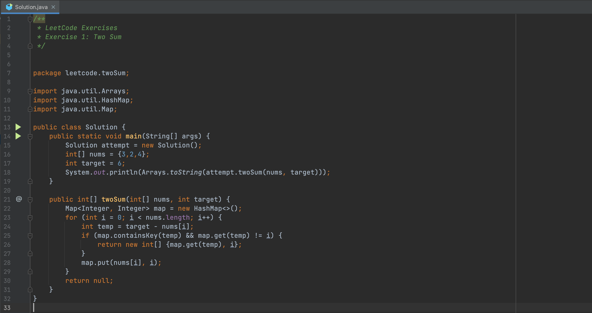

# LeetCode Exercises
### Exercise 1: Two Sum 

- You can find the problem description on the internet or LeetCode website: https://leetcode.com/problems/two-sum/
- Project link (GitHub): https://github.com/AcusPGP/DailyPractice
- Project's author: Pham Gia Phuc - "Acus" (Personal profile: https://github.com/AcusPGP)
-----------------------------------
<ins>

### Problem solving

</ins>

In this exercise:
- We use HashMap to instantly check for difference value.
- Map will add index of last occurrence of a num.
- If there is a correct result, it will immediately return the result to break the loop and prevent from using same element twice.
- The time complexity is O(n). By using HashMap, we scan through the array only once, so the time complexity is O(1).
- The space complexity is O(n), it depends on the number of elements in the given array.

### Picture

